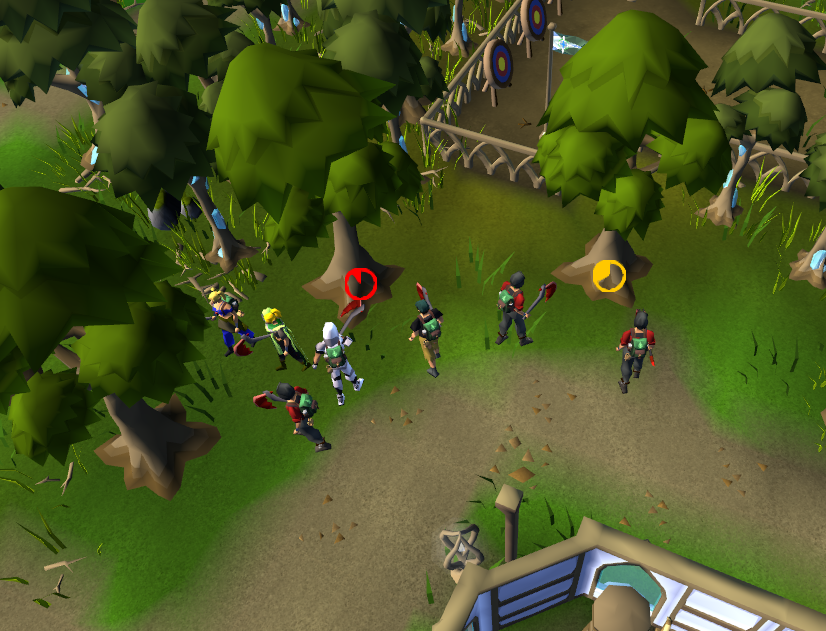

# Tree Despawn Timer

Demo of the plugin UI. You can also change the pie timer to show ticks as a number if you prefer.

This plugin will estimate the amount of time remaining to cut a tree before it'll be chopped down (despawn). This takes
into account the [new forestry mechanics](https://oldschool.runescape.wiki/w/Forestry) where a tree will stay standing
for a set amount of time, will regain health
when not being chopped, etc. The plugin is highly accurate if you are chopping alone, and reasonably accurate for
everything else.

If the plugin is reasonably confident that it knows how long a tree has left, it'll show a timer on the tree. If the
tree was already being chopped when you arrived, no time is shown as we cannot be confident in the time remaining.

Config Options:

* Timer Display Type - Choose between a pie timer and a tick counter
* Popular Tree Indicator - Increases the size of the timer when there are 10+ players chopping the tree. (Max players
  for the Forestry invisible woodcutting boost.)

Other Forestry Related Plugins:

* [Tree Count](https://runelite.net/plugin-hub/show/treecount) - shows the number of players currently chopping a tree
* [Item Charges Improved](https://runelite.net/plugin-hub/show/tictac7x-charges) - tracks the contents of the log
  basket (along with tons of other items)

Technical details gathered through testing (not official):

* Tree "health" only starts ticking down once someone has collected the first log from the tree. If you are chopping the
  tree but have yet to gather a log, the timer won't start.
* The "health" goes down by 1 every game tick (0.6s) as long as at least one person is chopping.
* The "health" goes back up by 1 every game tick as long as no one is chopping.

Known Issues:

* The time is an estimate so sometimes will have a few ticks left and be chopped down, or will run out of time and still
  be standing until someone collects another log.
    * Unfortunately this cannot be fixed as the system is not tick-perfect. It shouldn't be off by more than a few
      seconds though.
* The Tree Despawn Timer will show up for Farming trees despite it not being correct. I don't know of any way to
  differentiate farming trees from other identical trees. If you have a solution for this, file an issue!

Credits:

* Thanks to Infinitay's [tree count plugin](https://github.com/Infinitay/tree-count-plugin) for help with identifying
  which tree a player is chopping.